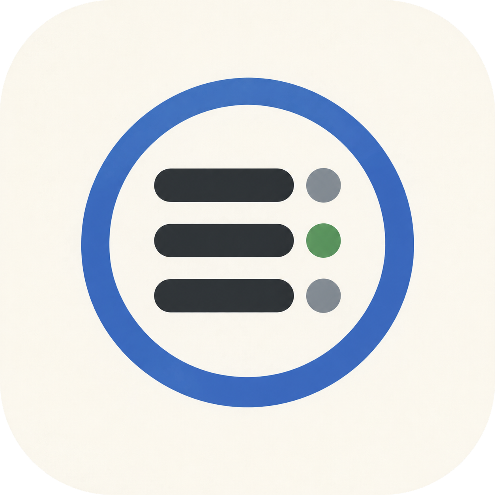

# LaunchScope

<p align="center">
  
</p>

<p align="center"><strong>Understand what runs in the background on your Mac.</strong></p>

把 macOS 里难懂的 `LaunchAgent`、`LaunchDaemon` 和动态后台任务，翻译成可以理解、可以核对、可以管理的本机清单。

LaunchScope 是一个纯原生 SwiftUI 工具。扫描、识别和管理都在本机完成，不依赖 AI，不联网，不采集遥测。

## 安装

安装最新 Release：

```bash
curl -fsSL https://raw.githubusercontent.com/1070124410/LaunchScope/main/scripts/install.sh | bash
```

或者从源码构建并安装：

```bash
git clone https://github.com/1070124410/LaunchScope.git
cd LaunchScope
make install
```

当前发布使用 ad-hoc 签名。第一次打开若被 macOS 拦截，请在 Finder 中右键应用并选择“打开”；安装脚本不会移除 quarantine 或绕过 Gatekeeper。

## 功能

- 总览后台项数量、运行状态、识别率、类别和需要关注的项目。
- 展示用途、厂商、来源、启动条件、PID、CPU、内存、退出码和原始命令证据。
- 明确区分“规则识别”“路径推断”和“用途未知”，不把推断伪装成事实。
- 临时停止、启动、禁用和重新启用用户级或系统级任务。
- 操作后重新读取 `launchctl` 状态，避免把命令返回当作操作成功。
- 用本地 JSON 扩展识别规则，无需重新编译。
- 支持版本化 Rule Pack、规则校验状态，以及隐私受限的 AI 识别上下文。
- 支持在应用内导入 Rule Pack，安装前展示新增、更新和未变化规则，并为原配置创建备份。
- 提供项目级 `$launchscope` skill 和离线工具，供 AI 生成、校验与合并候选规则。
- 导出适合提交 Issue 的 Markdown 清单；默认不导出命令、参数、日志或环境变量。

默认不扫描 `/System/Library` 中的 Apple 核心服务。系统级操作会使用标准 macOS 管理员授权窗口；禁用不会删除应用、plist 或用户数据。

## 系统要求

- macOS 14 Sonoma 或更新版本
- Xcode 16 或兼容 Swift 6 的命令行工具

## 构建与运行

```bash
git clone https://github.com/1070124410/LaunchScope.git
cd LaunchScope
swift test
./scripts/build-app.sh
open "dist/LaunchScope.app"
```

构建脚本会生成 ad-hoc 签名的本地应用。公开分发时仍需使用自己的 Developer ID、Notarization 和稳定 Bundle ID。

## 自定义识别规则

把规则保存到：

```text
~/Library/Application Support/LaunchScope/purpose-rules.json
```

自定义规则优先于内置规则。完整字段和示例见 [自定义规则文档](docs/CUSTOM_RULES.md) 与 [示例文件](examples/purpose-rules.example.json)。AI 协作和写入边界见 [Agent Protocol](docs/AGENT_PROTOCOL.md)。修改后在应用中刷新即可生效。

仓库内包含可自动发现的 `.agents/skills/launchscope`。应用不会调用 AI；它只复制经过隐私裁剪的识别请求，Rule Pack 仍需离线校验并由用户确认安装。

## 项目结构

```text
Sources/BackgroundButler/
├── Views/                  SwiftUI 页面与可复用组件
├── AppStore.swift          页面状态、筛选与操作编排
├── LaunchdScanner.swift    系统读取与解析
├── LaunchdManager.swift    启停和禁用操作
├── ServiceRepository.swift 扫描/管理的稳定接口
├── PurposeCatalog.swift    可解释的规则识别
├── AgentContextExporter.swift 隐私受限的 AI 识别请求
└── ReportExporter.swift    隐私受限的 Markdown 报告
```

设计边界和扩展点见 [架构说明](docs/ARCHITECTURE.md)。

## 安全与隐私

LaunchScope 会读取本机启动项、进程资源和 plist 元数据。它不读取浏览器数据、文档内容或网络流量，也不上传扫描结果。管理后台任务本身可能影响应用功能，请在操作前核对用途和来源。

公开 Issue 前仍应人工检查导出的名称和 Label。详见 [PRIVACY.md](PRIVACY.md) 和 [SECURITY.md](SECURITY.md)。

## 参与贡献

欢迎补充通用识别规则、解析测试、可访问性和多语言支持。请先阅读 [CONTRIBUTING.md](CONTRIBUTING.md)。

## License

[MIT](LICENSE)
